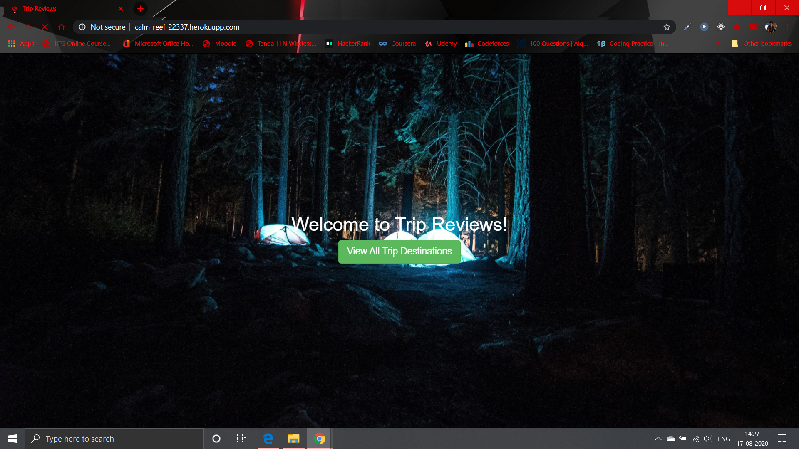
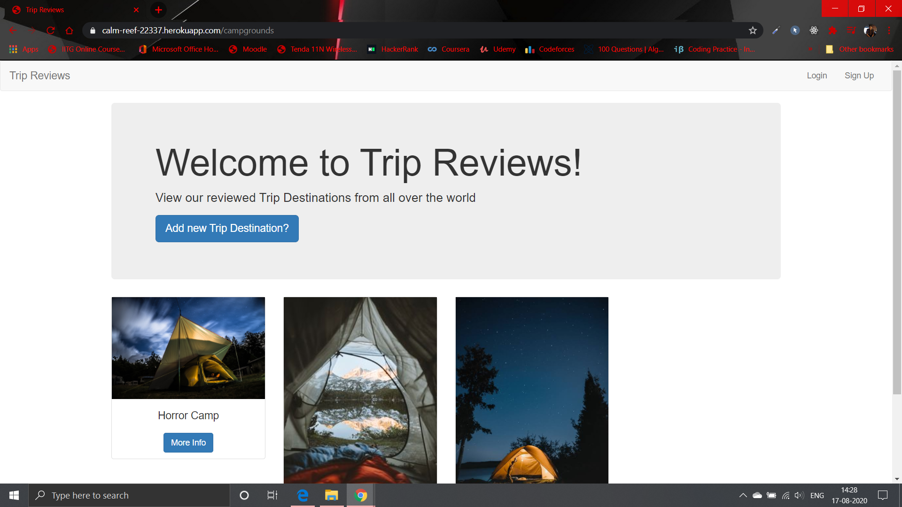

# [Trip-Reviews](http://bit.ly/trip1review)
A full-stack Node.js project from my web dev course with RESTful routing

## Initial Setup

* Add Landing Page
* Add Campgrounds Page that lists all campgrounds
Each Campground has:
* Name
* Image

## Layout and Basic Styling
* Create header and footer partials
* Add in Bootstrap

## Creating New Campgrounds
* Setup new campground POST route
* Add in body-parser
* Setup route to show form
* Add basic unstyled form

## Style the campgrounds page

* Add a better header/title
* Make campgrounds display in a grid